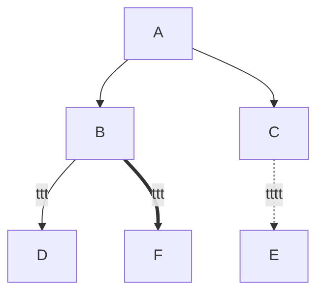
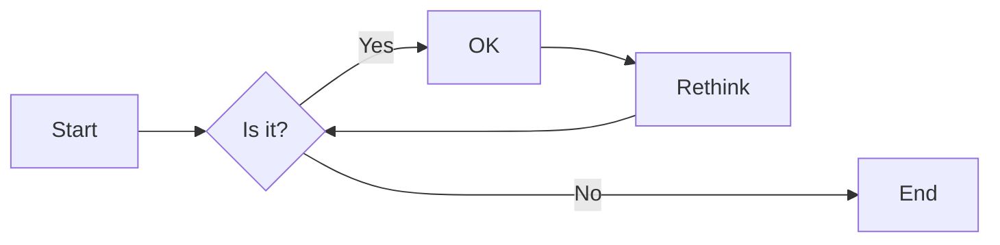
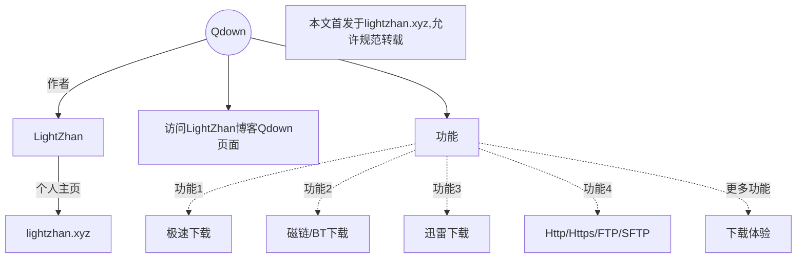
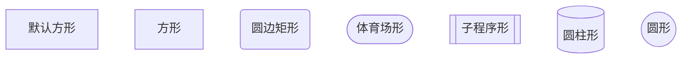
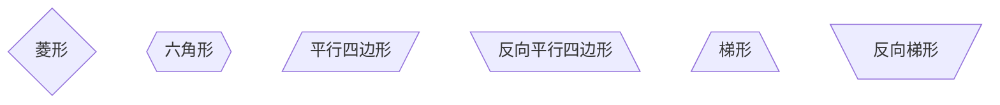
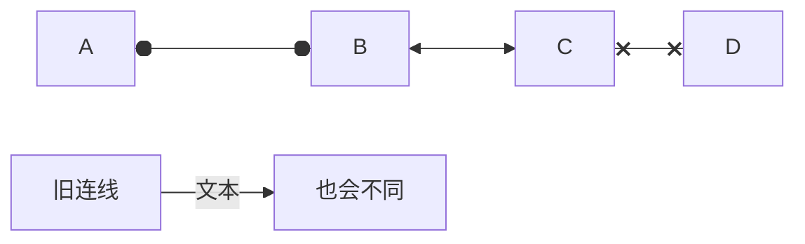
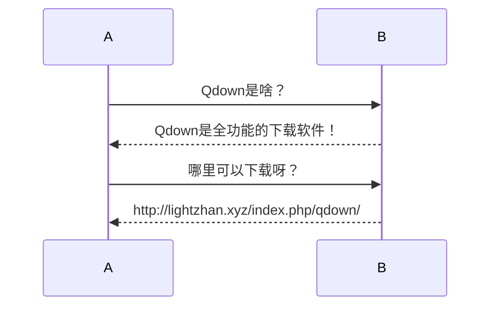
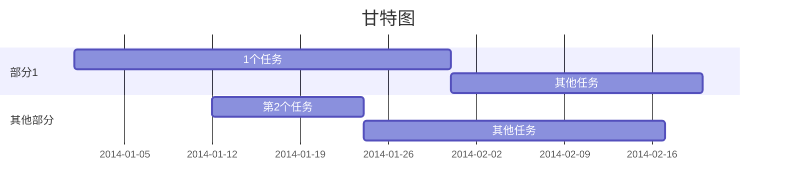
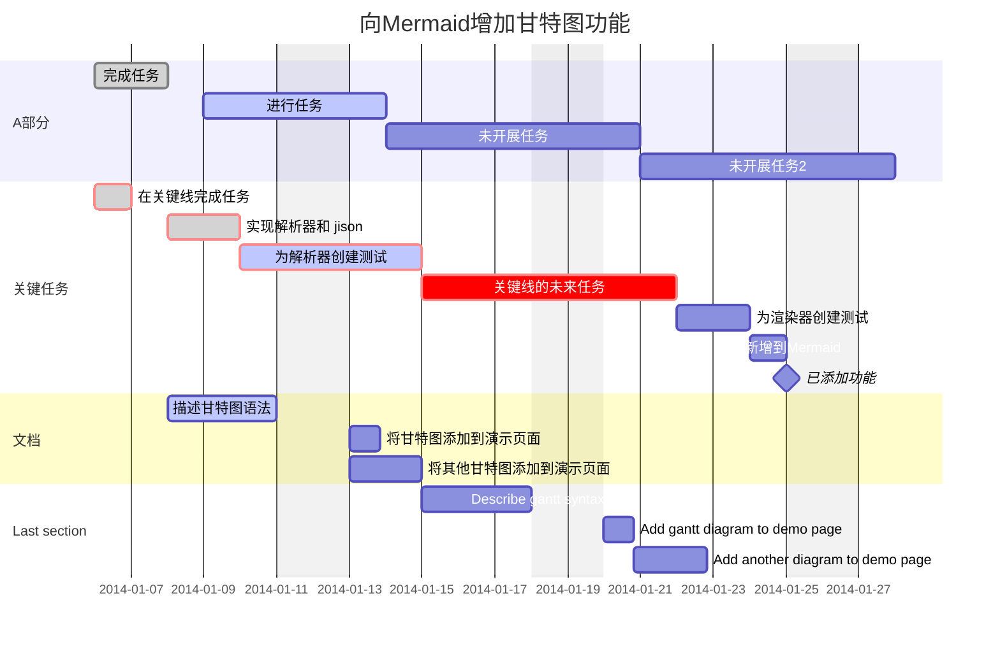

# 思维导图、流程图

```mermaid
graph TD
A-->B
A-->C
B-->|ttt|D
B==ttt==>F
C-.tttt.->E

```

```mermaid
graph LR
    A[Start] --> B{Is it?};
    B -- Yes --> C[OK];
    C --> D[Rethink];
    D --> B;
    B -- No ----> E[End];
```

```mermaid
graph TD
light[LightZhan]
    url[lightzhan.xyz]
    QdownUrl[访问LightZhan博客Qdown页面]
    Qdown((Qdown))
    function[功能]
    Qdown-->|作者|light 
    light--个人主页-->url
    Qdown-->function
    Qdown-->QdownUrl
    function1[极速下载]
    function2[磁链/BT下载]
    function3[迅雷下载]
    function5[下载体验]
    function4[Http/Https/FTP/SFTP]
    function-.功能1.->function1
    function-.功能2.->function2
    function-.功能3.->function3
    function-.功能4.->function4
    function-.更多功能.->function5
    annocement[本文首发于lightzhan.xyz,允许规范转载]
	
```

## 流程图语法

```mermaid
graph
    默认方形
    id1[方形]
    id2(圆边矩形)
    id3([体育场形])
	
    id4[[子程序形]]
    id5[(圆柱形)]
    id6((圆形))
```

```mermaid
graph
	id1{菱形}
	id2{{六角形}}
	id3[/平行四边形/]
	id4[\反向平行四边形\]
	id5[/梯形\]
	id6[\反向梯形/]
```

```mermaid
flowchart LR
    A o--o B
    B <--> C
    C x--x D
    
    旧连线 --文本--> 也会不同
```

# 时序图

```mermaid
sequenceDiagram
A->>B:Qdown是啥？
B-->>A:Qdown是全功能的下载软件！
A->>B:哪里可以下载呀？
B-->>A:http://lightzhan.xyz/index.php/qdown/
```

# 甘特图

```mermaid
gantt
    title 甘特图
	

    section 部分1
    1个任务           :a1, 2014-01-01, 30d
    其他任务          :after a1  , 20d

    section 其他部分
    第2个任务      :2014-01-12  , 12d
    其他任务      : 24d
```

```mermaid
gantt
    dateFormat  YYYY-MM-DD
    title       向Mermaid增加甘特图功能
    excludes    weekends
    %% (`excludes` accepts specific dates in YYYY-MM-DD format, days of the week ("sunday") or "weekends", but not the word "weekdays".)
    %% (`excludes` 接受 YYYY-MM-DD 格式的特定日期、星期几（“sunday”）或“weekends”，但不接受“weekdays”词。)

    section A部分
    完成任务                 :done,    des1, 2014-01-06,2014-01-08
    进行任务                 :active,  des2, 2014-01-09, 3d
    未开展任务               :         des3, after des2, 5d
    未开展任务2              :         des4, after des3, 5d

    section 关键任务
    在关键线完成任务             :crit, done, 2014-01-06,24h
    实现解析器和 jison          :crit, done, after des1, 2d
    为解析器创建测试             :crit, active, 3d
    关键线的未来任务              :crit, 5d
    为渲染器创建测试             :2d
    新增到Mermaid                      :1d
    已添加功能                 :milestone, 2014-01-25, 0d

    section 文档
    描述甘特图语法               :active, a1, after des1, 3d
    将甘特图添加到演示页面        :after a1  , 20h
    将其他甘特图添加到演示页面     :doc1, after a1  , 48h

    section Last section
    Describe gantt syntax               :after doc1, 3d
    Add gantt diagram to demo page      :20h
    Add another diagram to demo page    :48h
```
